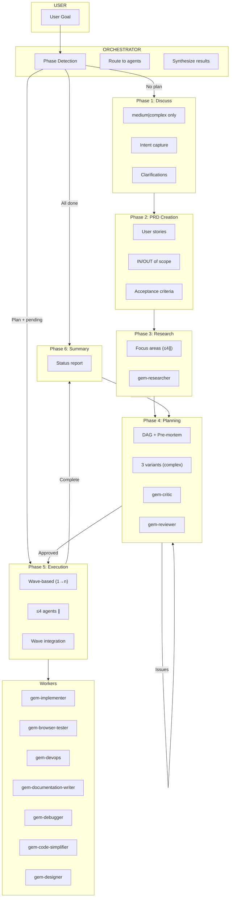

# Gem Team

> A modular, high-performance multi-agent orchestration framework for complex project execution, feature implementation, and automated verification.

[](https://awesome-copilot.github.com/plugins/#file=plugins%2Fgem-team)


## Installation

```bash
# Using Copilot CLI
copilot plugin install gem-team@awesome-copilot
```

> **[Install Gem Team Now →](https://aka.ms/awesome-copilot/install/agent?url=vscode%3Achat-agent%2Finstall%3Furl%3Dhttps%253A%252F%252Fraw.githubusercontent.com%252Fgithub%252Fawesome-copilot%252Fmain%252F.%252Fagents)**

---

## Quick Look


```mermaid
flowchart TB
    subgraph USER["USER"]
        goal["User Goal"]
    end

    subgraph ORCH["ORCHESTRATOR"]
        detect["Phase Detection"]
        route["Route to agents"]
        synthesize["Synthesize results"]
    end

    subgraph DISCUSS["Phase 1: Discuss"]
        dir1["medium|complex only"]
        intent["Intent capture"]
        clar["Clarifications"]
    end

    subgraph PRD["Phase 2: PRD Creation"]
        stories["User stories"]
        scope["IN/OUT of scope"]
        criteria["Acceptance criteria"]
    end

    subgraph PHASE3["Phase 3: Research"]
        focus["Focus areas (≤4∥)"]
        res["gem-researcher"]
    end

    subgraph PHASE4["Phase 4: Planning"]
        dag["DAG + Pre-mortem"]
        multi["3 variants (complex)"]
        critic["gem-critic"]
        verify["gem-reviewer"]
    end

    subgraph EXEC["Phase 5: Execution"]
        waves["Wave-based (1→n)"]
        parallel["≤4 agents ∥"]
        integ["Wave integration"]
    end

    subgraph WORKERS["Workers"]
        impl["gem-implementer"]
        test["gem-browser-tester"]
        devops["gem-devops"]
        docs["gem-documentation-writer"]
        debug["gem-debugger"]
        simplify["gem-code-simplifier"]
        design["gem-designer"]
    end

    subgraph SUMMARY["Phase 6: Summary"]
        status["Status report"]
    end

    goal --> detect

    detect --> |"No plan"| DISCUSS
    detect --> |"Plan + pending"| EXEC
    detect --> |"All done"| SUMMARY

    DISCUSS --> PRD
    PRD --> PHASE3
    PHASE3 --> PHASE4
    PHASE4 --> |"Approved"| EXEC
    PHASE4 --> |"Issues"| PHASE4
    EXEC --> WORKERS
    EXEC --> |"Complete"| SUMMARY
    SUMMARY --> |"Feedback"| PHASE4
```

## Core Workflow

The Orchestrator follows a 6-Phase workflow:

### Phase Detection

| Condition | Action |
|:----------|:-------|
| No plan | Discuss Phase (medium\|complex) or Research (simple) |
| Plan + pending tasks | Execution Loop |
| Plan + feedback | Planning |
| All tasks done | Summary |

### Phase 1: Discuss (medium|complex only)

- Identifies gray areas → 2-4 context-aware options per question
- Asks 3-5 targeted questions → Architectural decisions → `AGENTS.md`
- Task clarifications captured for PRD creation

### Phase 2: PRD Creation

- Creates `docs/PRD.yaml` from Discuss Phase outputs
- Includes: user stories, IN SCOPE, OUT OF SCOPE, acceptance criteria

### Phase 3: Research

- Detects complexity (simple/medium/complex)
- Delegates to gem-researcher (≤4 concurrent) per focus area
- Output: `docs/plan/{plan_id}/research_findings_{focus}.yaml`

### Phase 4: Planning

- Complex: 3 planner variants (a/b/c) → selects best
- gem-reviewer validates (coverage, atomicity, deps, PRD)
- gem-critic challenges assumptions
- Output: `docs/plan/{plan_id}/plan.yaml` (DAG + waves)

### Phase 5: Execution

- Executes in waves (wave 1 first, wave 2 after)
- ≤4 agents parallel per wave
- TDD cycle: Red → Green → Refactor → Verify
- Wave integration: get_errors → build → lint/typecheck/tests

### Phase 6: Summary

- Presents status, next steps
- User feedback → routes back to Planning

---

## The Agent Team

| Agent | Role | When to Use |
| :--- | :--- | :--- |
| `gem-orchestrator` | **ORCHESTRATOR** | Coordinates multi-agent workflows, delegates tasks. Never executes directly. |
| `gem-researcher` | **RESEARCHER** | Research, explore, analyze code, find patterns, investigate dependencies. |
| `gem-planner` | **PLANNER** | Plan, design approach, break down work, estimate effort. |
| `gem-implementer` | **IMPLEMENTER** | Implement, build, create, code, write, fix (TDD). |
| `gem-browser-tester` | **BROWSER TESTER** | Test UI, browser tests, E2E, visual regression, accessibility. |
| `gem-devops` | **DEVOPS** | Deploy, configure infrastructure, CI/CD, containers. |
| `gem-reviewer` | **REVIEWER** | Review, audit, security scan, compliance. Never modifies. |
| `gem-documentation-writer` | **DOCUMENTATION** | Document, write docs, README, API docs, diagrams. |
| `gem-debugger` | **DEBUGGER** | Debug, diagnose, root cause analysis, trace errors. Never fixes. |
| `gem-critic` | **CRITIC** | Critique, challenge assumptions, edge cases, over-engineering. |
| `gem-code-simplifier` | **SIMPLIFIER** | Simplify, refactor, dead code removal, reduce complexity. |
| `gem-designer` | **DESIGNER** | Design UI, create themes, layouts, validate accessibility. |

---

## Key Features

| Feature | Description |
|:--------|:------------|
| **TDD (Red-Green-Refactor)** | Tests first → fail → minimal code → refactor → verify |
| **Security-First** | OWASP scanning, secrets/PII detection, tiered depth review |
| **Pre-Mortem Analysis** | Failure modes identified BEFORE execution |
| **Multi-Plan Selection** | Complex tasks: 3 planner variants → selects best DAG |
| **Wave-Based Execution** | Parallel agent execution with integration gates |
| **Approval Gates** | Security + deployment approval for sensitive ops |
| **Multi-Browser Testing** | Chrome MCP, Playwright, Agent Browser |
| **Codebase Patterns** | Avoids reinventing the wheel |
| **Self-Critique** | Reflection step before output (0.85 confidence threshold) |
| **Root-Cause Diagnosis** | Stack trace analysis, regression bisection |
| **Constructive Critique** | Challenges assumptions, finds edge cases |

---

## Knowledge Sources

All agents consult in priority order:

| Source | Description |
|:-------|:------------|
| `docs/PRD.yaml` | Product requirements — scope and acceptance criteria |
| Codebase patterns | Semantic search for implementations, reusable components |
| `AGENTS.md` | Team conventions and architectural decisions |
| Context7 | Library and framework documentation |
| Official docs | Guides, configuration, reference materials |
| Online search | Best practices, troubleshooting, GitHub issues |

---

## Generated Artifacts

| Agent | Generates | Path |
| :--- | :--- | :--- |
| gem-orchestrator | PRD | `docs/PRD.yaml` |
| gem-planner | plan.yaml | `docs/plan/{plan_id}/plan.yaml` |
| gem-researcher | findings | `docs/plan/{plan_id}/research_findings_{focus}.yaml` |
| gem-browser-tester | evidence | `docs/plan/{plan_id}/evidence/{task_id}/` |
| gem-debugger | diagnosis | `docs/plan/{plan_id}/logs/{agent}_{task_id}_{timestamp}.yaml` |

---

## Agent Protocol

### Core Rules

- Output ONLY requested deliverable (code: code ONLY)
- Think-Before-Action via internal `<thought>` block
- Batch independent operations; context-efficient reads (≤200 lines)
- Agent-specific `verification` criteria from plan.yaml
- Self-Critique: agents reflect on output before returning results
- Knowledge Sources: agents consult prioritized references (PRD → codebase → AGENTS.md → Context7 → docs → online)

### Verification by Agent

| Agent | Verification |
| :--- | :--- |
| Implementer | get_errors → typecheck → unit tests |
| Debugger | reproduce → stack trace → root cause → fix recommendations |
| Critic | assumption audit → edge case discovery → over-engineering detection → logic gap analysis |
| Browser Tester | validation matrix → console → network → accessibility |
| Reviewer (task) | OWASP scan → code quality → logic |
| Reviewer (wave) | get_errors → build → lint → typecheck → tests |
| Reviewer (plan) | coverage → atomicity → deps → PRD alignment |
| DevOps | deployment → health checks → idempotency |
| Doc Writer | completeness → code parity → formatting |

---

## Contributing

Contributions are welcome! Please feel free to submit a Pull Request.

## License

This project is licensed under the MIT License.

## Support

If you encounter any issues or have questions, please [open an issue](https://github.com/mubaidr/gem-team/issues) on GitHub.
