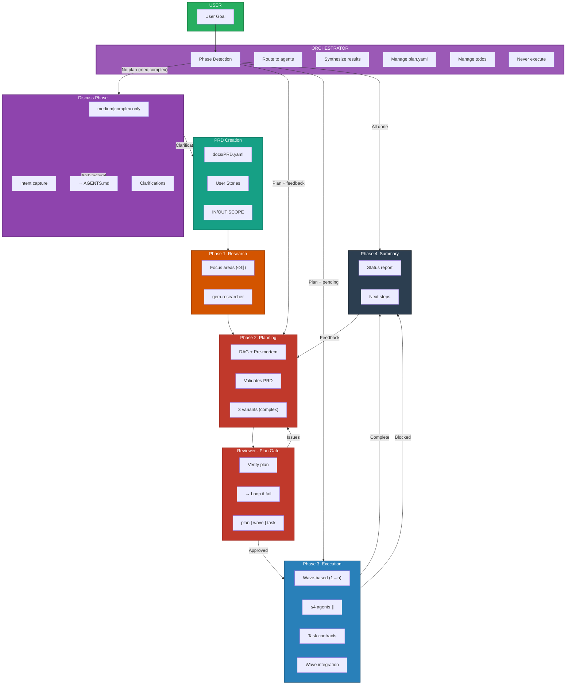

# Gem Team

> A modular, high-performance multi-agent orchestration framework for complex project execution, feature implementation, and automated verification.

[](https://awesome-copilot.github.com/plugins/#file=plugins%2Fgem-team)


## Installation

Install directly from the [Awesome Copilot](https://awesome-copilot.github.com/plugins/#file=plugins%2Fgem-team) marketplace — the official directory for Copilot extensions.

```bash
# Using Copilot CLI
copilot plugin install gem-team@awesome-copilot
```

> **[Install Gem Team Now →](https://aka.ms/awesome-copilot/install/agent?url=vscode%3Achat-agent%2Finstall%3Furl%3Dhttps%253A%252F%252Fraw.githubusercontent.com%252Fgithub%252Fawesome-copilot%252Fmain%252F.%252Fagents)**

---

## Quick Look


```mermaid
flowchart TB
subgraph USER[" USER"]
  goal["User Goal"]
end

subgraph ORCH[" ORCHESTRATOR"]
  detect["Phase Detection"]
  route["Route to agents"]
  synthesize["Synthesize results"]
  state["Manage plan.yaml"]
  todos["Manage todos"]
  exec["Never execute"]
end

subgraph DISCUSS[" Discuss Phase"]
  dir1["medium|complex only"]
  intent["Intent capture"]
  arch["→ AGENTS.md"]
  clar["Clarifications"]
end

subgraph PRD[" PRD Creation"]
  prd["docs/PRD.yaml"]
  stories["User Stories"]
  scope["IN/OUT SCOPE"]
end

subgraph PHASE1[" Phase 1: Research"]
  focus["Focus areas (≤4∥)"]
  res["gem-researcher"]
end

subgraph PHASE2[" Phase 2: Planning"]
  dag["DAG + Pre-mortem"]
  valid["Validates PRD"]
  multi["3 variants (complex)"]
end

subgraph REVIEW[" Reviewer - Plan Gate"]
  ver["Verify plan"]
  loop["→ Loop if fail"]
  scopes["plan | wave | task"]
end

subgraph EXEC[" Phase 3: Execution"]
  waves["Wave-based (1→n)"]
  parallel["≤4 agents ∥"]
  contracts["Task contracts"]
  integ["Wave integration"]
end

subgraph SUMMARY[" Phase 4: Summary"]
  status["Status report"]
  next["Next steps"]
end

goal --> detect

detect --> |"No plan (med|complex)"| DISCUSS
detect --> |"Plan + feedback"| PHASE2
detect --> |"Plan + pending"| EXEC
detect --> |"All done"| SUMMARY

DISCUSS --> |"Architectural"| arch
DISCUSS --> |"Clarifications"| PRD

PRD --> PHASE1
PHASE1 --> PHASE2
PHASE2 --> REVIEW
REVIEW --> |"Approved"| EXEC
REVIEW --> |"Issues"| PHASE2
EXEC --> |"Complete"| SUMMARY
EXEC --> |"Blocked"| SUMMARY
SUMMARY --> |"Feedback"| PHASE2

style ORCH fill:#9b59b6,color:#fff,stroke:#7d3c98,stroke-width:3px
style USER fill:#27ae60,color:#fff,stroke:#1e8449,stroke-width:2px
style REVIEW fill:#c0392b,color:#fff,stroke:#a93226,stroke-width:2px
style EXEC fill:#2980b9,color:#fff,stroke:#1a5276,stroke-width:2px
style DISCUSS fill:#8e44ad,color:#fff,stroke:#6c3483,stroke-width:2px
style PRD fill:#16a085,color:#fff,stroke:#117a65,stroke-width:2px
style PHASE1 fill:#d35400,color:#fff,stroke:#a04000,stroke-width:2px
style PHASE2 fill:#c0392b,color:#fff,stroke:#a93226,stroke-width:2px
style SUMMARY fill:#2c3e50,color:#fff,stroke:#1a252f,stroke-width:2px
```

## The Agent Team

| Agent | Role | When to Use |
| :------------------------- | :--- | :-------------------------------------------------------------------------------------------- |
| `gem-orchestrator` | **ORCHESTRATOR** | Team Lead — Coordinates multi-agent workflows, delegates tasks, synthesizes results. Detects phase, routes to agents, manages Discuss Phase, PRD creation, and multi-plan selection. |
| `gem-researcher` | **RESEARCHER** | User asks to research, explore, analyze code, find patterns, investigate dependencies, or understand architecture. |
| `gem-planner` | **PLANNER** | User asks to plan, design an approach, break down work, estimate effort, or create an implementation strategy. |
| `gem-implementer` | **IMPLEMENTER** | User asks to implement, build, create, code, write, fix, or refactor. Uses TDD. Never reviews its own work. |
| `gem-browser-tester` | **BROWSER TESTER** | User asks to test UI, run browser tests, verify visual appearance, check responsive design, or automate E2E scenarios. |
| `gem-devops` | **DEVOPS** | User asks to deploy, configure infrastructure, set up CI/CD, manage containers, or handle deployment tasks. |
| `gem-reviewer` | **REVIEWER** | User asks to review, audit, check security, validate, or verify compliance. Also gates plans and waves. Never modifies code. |
| `gem-documentation-writer` | **DOCUMENTATION WRITER** | User asks to document, write docs, create README, generate API documentation, or produce technical writing. |
| `gem-debugger` | **DEBUGGER** | User asks to debug, diagnose, find root cause, trace errors, or investigate failures. Never implements fixes. |
| `gem-critic` | **CRITIC** | User asks to critique, challenge assumptions, find edge cases, review quality, or check for over-engineering. Never implements. |

---

## Agent Structure

Each agent follows a consistent structure:

| Section | Purpose |
|:--------|:--------|
| **Role** | One-line identity and scope |
| **Expertise** | Domain-specific skills (e.g., TDD, OWASP, Browser Automation) |
| **Knowledge Sources** | Prioritized references: PRD → Codebase patterns → AGENTS.md → Context7 → Official docs → Online search |
| **Composition** | Execution pattern and phase breakdown |
| **Workflow** | Step-by-step process with Self-Critique reflection |
| **Constraints** | Shared infra (tool usage, error handling, retry, communication) |
| **Constitutional Constraints** | Hard rules specific to the agent's domain |
| **Anti-Patterns** | Violations to avoid |
| **Directives** | Agent-specific execution instructions |

---

## Knowledge Sources

All agents consult these sources in priority order:

| Source | Description |
|:-------|:------------|
| `docs/PRD.yaml` | Product requirements — source of truth for scope and acceptance criteria |
| Codebase patterns | Semantic search for existing implementations, reusable components, conventions |
| `AGENTS.md` | Team conventions and architectural decisions |
| Context7 | Library and framework documentation |
| Official docs | Guides, configuration, and reference materials |
| Online search | Best practices, troubleshooting, GitHub issues, community resources |

The Implementer additionally consults:

| Source | Description |
|:-------|:------------|
| Frontend design | UI aesthetics, typography, motion, spatial composition |
| Accessibility | WCAG guidelines, ARIA patterns, keyboard navigation |
| Design patterns | Component architecture, state management, responsive patterns |

---

## Key Differentiators

| Feature | What It Does |
|:--------|:-------------|
|  **TDD (Red-Green-Refactor)** | Tests first → fail → minimal code → refactor → verify |
|  **Security-First Review** | OWASP scanning, secrets/PII detection, tiered depth |
|  **Pre-Mortem Analysis** | Failure modes identified BEFORE execution |
|  **Intent Capture** | Discuss phase locks user intent, architectural decisions persist to `AGENTS.md` |
|  **Approval Gates** | Security + deployment approval for sensitive ops |
|  **Multi-Browser Testing** | Chrome MCP, Playwright, Agent Browser support |
|  **Sequential Thinking** | Chain-of-thought for complex analysis (>50 files) |
|  **Codebase Pattern Discovery** | Agents search for existing patterns before implementing — avoids reinventing wheels |
|  **Self-Critique** | Concise reflection step in every workflow to catch gaps before output |
|  **Lightweight Validation** | `get_errors` for fast feedback before full build/lint/test |
|  **Root-Cause Diagnosis** | Dedicated debugger with stack trace analysis regression bisection and fix recommendations |
|  **Constructive Critique** | Devil's advocate challenges assumptions finds edge cases identifies over-engineering |

---

## Why Gem Team?

### Single-Agent Problems → Gem Team Solutions

| Problem | Solution |
|:--------|:--------|
| Context overload | Specialized agents with focused expertise |
| No specialization | 9 expert agents (researcher, planner, implementer, tester, reviewer, devops, docs, debugger, critic) |
| Sequential bottlenecks | DAG-based parallel execution (≤4 agents simultaneously) |
| Missing verification | TDD + mandatory verification gates |
| Intent misalignment | Discuss phase captures intent before planning |
| No audit trail | Persistent `plan.yaml` and `PRD.yaml` tracks every decision & outcome |

### Why It Works

- **10x Faster** — Parallel execution eliminates bottlenecks
- **Higher Quality** — Specialized agents + TDD + verification gates = fewer bugs
- **Built-in Security** — OWASP scanning on critical tasks
- **Full Visibility** — Real-time status, clear approval gates
- **Resilient** — Pre-mortem analysis, failure handling, auto-replanning
- **Pattern Reuse** — Codebase pattern discovery prevents reinventing wheels

---

## Core Workflow

The Orchestrator follows a 4-Phase workflow with phase detection at the start:

### Phase Detection

- User provides plan id OR plan path → Load plan → Execution Loop
- No plan → Discuss Phase (medium|complex) or Research (simple)
- Plan + user_feedback → Planning
- Plan + all tasks completed → Summary

### Discuss Phase (medium|complex only)

- Identifies gray areas → generates 2-4 context-aware options per question
- Asks 3-5 targeted questions → Architectural decisions → `AGENTS.md`
- Task clarifications → PRD creation

### PRD Creation

- Source of truth for research & planning
- Includes: user stories, IN/OUT SCOPE, acceptance criteria, NEEDS CLARIFICATION

### Phase 1: Research

- Detects complexity (simple/medium/complex)
- Delegates to gem-researcher (≤4 concurrent) per focus area
- Output: `docs/plan/{plan_id}/research_findings_{focus}.yaml`

### Phase 2: Planning

- Complex: 3 planner variants (a/b/c) → selects best
- Simple/Medium: 1 planner run
- Plan Verification Gate: gem-reviewer validates (coverage, atomicity, deps, PRD)
- Output: `docs/plan/{plan_id}/plan.yaml` (DAG + waves)

### Phase 3: Execution Loop

- Executes in waves (wave 1 first, wave 2 after, etc.)
- ≤4 agents parallel per wave
- TDD cycle: Red (test fails) → Green (minimal code) → Refactor → Verify
- `get_errors` lightweight validation before full build/lint/test

### Wave Integration Check

get_errors → build → lint/typecheck/tests after each wave

### Phase 4: Summary

- Presents status, next steps
- User feedback → routes back to Planning

---

## Key Features

| Feature | Description |
|:--------|:------------|
|  **Copilot Steer** | Send steer to orchestrator → auto-routes to correct agent |
|  **Team Lead Personality** | Energetic announcements, phase/wave status, celebrates wins |
|  **Focus-Based Gathering** | Multiple researchers in parallel, each targeting specific `focus_area` |
|  **Plan Continuity** | `docs/plan/{plan_id}/plan.yaml` provides recovery, retry, full audit trail |
|  **PRD Support** | Machine-readable spec: user stories, scope, acceptance criteria, state machines |
|  **Agent Hierarchy** | Orchestrator (`disable-model-invocation: true`) → Workers (execute via tools) |
|  **Context-Efficient** | Semantic search, ≤200-line reads, batch operations |
|  **Self-Critique** | Every agent reflects on output quality before returning results |

### Review Scopes

| Scope | Purpose |
|:------|:--------|
| `plan` | Pre-execution validation (coverage, atomicity, deps, PRD alignment) |
| `wave` | Integration checks (build, lint, typecheck, tests) |
| `task` | Individual code review (OWASP, secrets, logic) |

### Generated Artifacts by Agent

| Agent | Generates | Path |
| :--- | :--- | :--- |
| gem-orchestrator | PRD (initial) | `docs/PRD.yaml` |
| gem-planner | plan.yaml | `docs/plan/{plan_id}/plan.yaml` |
| gem-researcher | findings YAML | `docs/plan/{plan_id}/research_findings_{focus}.yaml` |
| gem-documentation-writer | PRD (final) | `docs/PRD.yaml` |
| gem-browser-tester | evidence (on failure) | `docs/plan/{plan_id}/evidence/{task_id}/` |
| gem-debugger | diagnosis YAML | `docs/plan/{plan_id}/logs/{agent}_{task_id}_{timestamp}.yaml` |
| gem-critic | critique report | In-line via `extra` JSON output |

---

## Agent Protocol

### Input → Output Delegation

**Input:**

```yaml
task_id, plan_id, plan_path, task_definition (agent-specific)
```

**Completion (Output):**

```json
{
  "status": "completed|failed|needs_revision",
  "task_id",
  "plan_id",
  "summary": "≤3 sentences",
  "extra": {}
}
```

### Core Rules

- Output ONLY requested deliverable (code: code ONLY)
- Think-Before-Action via internal `<thought>` block
- Batch independent operations; context-efficient reads (≤200 lines)
- Agent-specific `verification` criteria from plan.yaml
- Self-Critique: agents reflect on output before returning results
- Knowledge Sources: agents consult prioritized references (PRD → codebase → AGENTS.md → Context7 → docs → online)

### Verification by Agent

| Agent | Verification |
| :--- | :--- |
| Implementer | get_errors → typecheck → unit tests |
| Debugger | reproduce → stack trace → root cause → fix recommendations |
| Critic | assumption audit → edge case discovery → over-engineering detection → logic gap analysis |
| Browser Tester | validation matrix → console → network → accessibility |
| Reviewer (task) | OWASP scan → code quality → logic |
| Reviewer (wave) | get_errors → build → lint → typecheck → tests |
| Reviewer (plan) | coverage → atomicity → deps → PRD alignment |
| DevOps | deployment → health checks → idempotency |
| Doc Writer | completeness → code parity → formatting |

---

## License

MIT License - See [LICENSE](LICENSE) for details.
