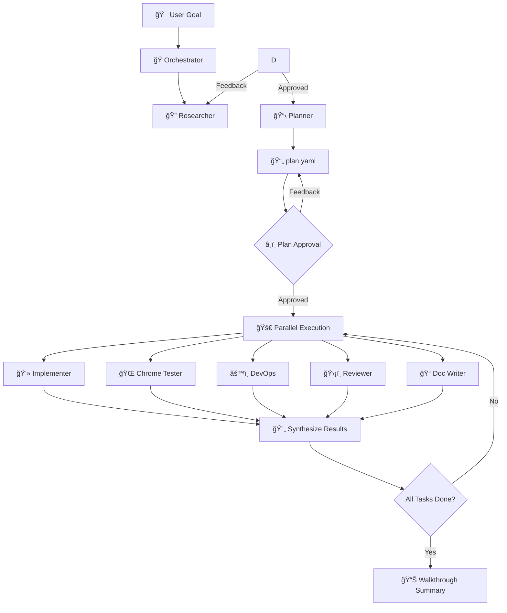

<p align="center">
  
  
  
  
</p>

# 💎 Gem Team: Multi-Agent Orchestration Framework

> Transform complex projects into coordinated, verified, production-ready deliverables — with intelligent agents that research, plan, implement, test, and document autonomously.

A modular, high-performance multi-agent team designed for complex project execution, feature implementation, and automated verification.

---

## ⚡ Why Gem Team?

### The Problem with Single-Agent AI

Traditional AI coding assistants hit walls when projects get complex:

- Context overload — One agent trying to hold everything leads to mistakes
- No specialization — Jack of all trades, master of none
- Sequential bottlenecks — Tasks execute one-by-one, wasting time
- Missing verification — Changes ship without proper testing
- No audit trail — What changed? Why? Who knows...

### The Gem Team Solution

| Challenge                     | Gem Team Approach                                                                                         |
| :---------------------------- | :-------------------------------------------------------------------------------------------------------- |
| 🧠 Context Overload       | Specialized agents with focused expertise — each holds only what it needs                                 |
| 🎯 Lack of Specialization | 7 expert agents: researcher, planner, implementer, tester, reviewer, devops, and documentation specialist |
| 🐢 Sequential Bottlenecks | DAG-based parallel execution — up to 4 agents work simultaneously                                         |
| ❌ Missing Verification   | Verification-first: no task completes without passing its verification command                            |
| 📜 No Audit Trail         | Persistent `plan.yaml` state file tracks every decision, status, and outcome                              |

### Key Benefits

- 🚀 10x Faster Execution — Parallel agent execution eliminates bottlenecks
- 🎯 Higher Quality Output — Specialized agents + mandatory verification = fewer bugs
- 🔒 Built-in Security — Dedicated reviewer agent applies OWASP scanning on critical tasks
- 📊 Full Visibility — Real-time plan status, clear approval gates, comprehensive summaries
- 🔄 Resilient Workflows — Pre-mortem analysis, failure handling, and automatic replanning
- 🧠 Persistent Memory System — Cross-agent knowledge sharing with structured citations and reflection learning
- 📋 Strict Communication Protocol — Standardized input/output formats for reliable delegation and handoffs
- 🎯 Autonomous Execution — Most agents work independently without user intervention (except approval gates)
- 🔧 Context-Efficient Operations — Smart file reading (semantic search, 200-line limits) and batch operations for speed

---

## 🚀 Overview

Gem Team follows a **Delegation-First** pattern. The Orchestrator never executes—it only detects phase, routes to agents, and synthesizes results. All state operations are managed directly by the Orchestrator.

```text
┌─────────────────────────────────────────────────────────────────┐
│                         USER GOAL                               │
└──────────────────────────────┬──────────────────────────────────┘
                               ▼
┌──────────────────────────────────────────────────────────────────┐
│                      ORCHESTRATOR                               │
│  • Detect phase          • Route to agents                     │
│  • Synthesize results    • Manage plan.yaml state              │
│  • Manage todos          • Never execute                       │
└──────────────────────────────┬───────────────────────────────────┘
                               ▼
         ┌──────────────────────┴──────────────────────┐
         ▼                                             ▼
┌───────────────────┐                     ┌────────────────────────┐
│  RESEARCHER       │ ──────────────────▶ │    PLANNER              │
│  Explore codebase │     findings         │  DAG Task Decomposition│
└───────────────────┘                     └────────────┬───────────┘
                                                       ▼
                                           ┌────────────────────────┐
                                           │  plan.yaml             │
                                           │  (Task DAG + State)    │
                                           └────────────┬───────────┘
                                                       ▼
         ┌────────────────────┬─────────────────────────┼─────────────────────────┬────────────────────┐
         ▼                    ▼                         ▼                         ▼                    ▼
┌──────────────┐    ┌──────────────┐         ┌──────────────┐         ┌──────────────┐      ┌──────────────┐
│ IMPLEMENTER  │    │ BROWSER      │         │ DEVOPS       │         │ REVIEWER     │      │ DOC WRITER   │
│ TDD Execution│    │ TESTER       │         │ CI/CD + Infra│         │ Security Gate│      │ Technical    │
└──────────────┘    └──────────────┘         └──────────────┘         └──────────────┘      └──────────────┘
```

---

## 🤖 Agent Roles

| Agent | Role | Primary Responsibility |
| :------------------------- | :--- | :-------------------------------------------------------------------------------------------- |
| `gem-orchestrator` | ORCHESTRATOR | Coordinate workflow. Detect phase → Route to agents → Synthesize results. Manage plan.yaml state and todos. Never execute. |
| `gem-researcher` | RESEARCHER | Explore codebase, identify patterns, map dependencies. Deliver structured findings in YAML. Never implement. |
| `gem-planner` | PLANNER | Design DAG-based plans, decompose tasks, identify failure modes. Create plan.yaml. Never implement. |
| `gem-implementer` | IMPLEMENTER | Write code using TDD. Follow plan specifications. Ensure tests pass. Never review. |
| `gem-browser-tester` | BROWSER TESTER | Run E2E tests in browser, verify UI/UX, check accessibility. Deliver test results. Never implement. |
| `gem-devops` | DEVOPS | Deploy infrastructure, manage CI/CD, configure containers. Ensure idempotency. Never implement. |
| `gem-reviewer` | REVIEWER | Scan for security issues, detect secrets, verify spec compliance. Deliver audit report. Never implement. |
| `gem-documentation-writer` | DOCUMENTATION WRITER | Write technical docs, generate diagrams, maintain code-documentation parity. Never implement. |

---

## 🔄 Core Workflow



### Workflow Stages

1. **Phase Detection** — Orchestrator reads plan.yaml to check existence and task statuses
2. **Phase 1: Research** — Orchestrator delegates to RESEARCHER(s) per focus_area to gather context
3. **Phase 2: Planning** — PLANNER creates DAG-based plan.yaml with pre-mortem analysis
4. **Phase 3: Execution Loop**
   - Orchestrator: Read pending tasks (status=pending, dependencies=completed)
   - Orchestrator: Create todos from task list using manage_todo_list tool
   - Workers execute (up to 4 parallel): IMPLEMENTER, BROWSER TESTER, DEVOPS, REVIEWER, DOC WRITER
   - Orchestrator: Update dependencies + Update task status in plan.yaml
   - Exit: pending_count == 0 → Phase 4
5. **Phase 4: Completion** — Orchestrator validates completion → DOC WRITER creates walkthrough

---

## 🛠 Key Features

### 🎯 VS Code Copilot Steer Support

Send a steer message to `gem-orchestrator` and it automatically redirects to the appropriate agent — researcher for new context, planner for plan updates — integrating your request into the active workflow.

### 🔍 Focus-Based Context Gathering

The Orchestrator identifies key domains or features and launches multiple Researcher agents in parallel, each targeting a specific `focus_area`. This ensures deep, specific context is gathered for every part of the system before the Planner synthesizes it all into a unified `plan.yaml`.

### 🧪 Verification-First (TDD)

No task completes without passing its defined `verification` command. Implementers follow strict TDD discipline:

- Write tests FIRST
- Confirm tests FAIL
- Write MINIMAL code to pass
- Check `get_errors` after every edit

### 🛡️ Security-First Review

The Reviewer agent acts as a security gatekeeper for critical tasks:

- OWASP Top 10 scanning
- Secrets/PII detection
- Compliance verification
- Tiered review depth (Full → Standard → Lightweight)

### 📊 Pre-Mortem Analysis

For complex plans, the Planner runs pre-mortem analysis — identifying potential failure modes, their likelihood, impact, and mitigation strategies BEFORE execution begins.

### 📝 Plan Continuity & Audit Trail

State persists in `docs/plan/{plan_id}/plan.yaml`, providing:

- Recovery from interruptions
- Complex retry handling
- Clear audit trail of project evolution
- Full traceability of decisions

### 🧠 Cross-Agent Memory

Agents share knowledge via a persistent memory system with structured citations:

- Researcher: Reads memories to understand project context before exploration
- Planner: Stores architectural decisions, design patterns, tech stack choices
- Orchestrator: Stores project-level decisions, product vision, code conventions
- Reflection Memory: All agents learn from execution, user guidance, decisions, and patterns
- Just-in-time verification: Citations (file:line) are checked before using memories

Memory format follows structured pattern:

```markdown
## [Subject/Topic]

Fact: [What you learned - concise, actionable]

Citations:
- `file:line` - Reference to code that supports this fact

Reason: [Why this matters - impact, consequences, benefits]

Last Updated: [Date]
```

### 🔒 Agent Hierarchy

```text
User → ORCHESTRATOR → WORKERS (execute)
```

- **Orchestrator**: `disable-model-invocation: true` — delegates ALL work, manages plan.yaml state and todos, never executes
- **Workers**: `disable-model-invocation: false` — execute tasks via tools
  - RESEARCHER, PLANNER, IMPLEMENTER, BROWSER TESTER, DEVOPS, REVIEWER, DOC WRITER
- Isolation: Workers cannot call other subagents — all collaboration mediated by Orchestrator

---

## 📁 Project Structure

```text
gem-team/
├── gem-orchestrator.agent.md      # Coordination hub (routes all work, manages state)
├── gem-researcher.agent.md        # Context gathering
├── gem-planner.agent.md           # DAG-based planning
├── gem-implementer.agent.md       # TDD code execution
├── gem-browser-tester.agent.md    # Browser automation
├── gem-devops.agent.md            # Infrastructure & CI/CD
├── gem-reviewer.agent.md          # Security gatekeeper
├── gem-documentation-writer.agent.md  # Technical docs
├── docs/
│   └── plan/{plan_id}/
│       ├── research_findings_*.yaml   # Research output
│       └── plan.yaml              # Task DAG state
└── README.md
```

---

## 📋 Agent Communication Protocol

### Strict Input/Output Formats

All agents follow strict input/output formats for reliable delegation and handoff:

#### Input Format (Delegation)

```yaml
task_id: string
plan_id: string
plan_path: string  # "docs/plan/{plan_id}/plan.yaml"
task_definition: object  # Full task from plan.yaml
  # Agent-specific fields included here
```

#### Output Format (Completion)

```json
{
  "status": "success|failed|needs_revision",
  "task_id": "[task_id]",
  "plan_id": "[plan_id]",
  "summary": "[brief summary ≤3 sentences]",
  "extra": {
    "agent_specific_data": {}
  }
}
```

### Universal Operating Rules

All agents follow these core operating rules:

- Tool Activation: Always activate tools before use
- Built-in preferred: Use built-in tools over external ones
- Batch independent calls: Execute independent operations simultaneously
- Think-Before-Action: Validate logic and simulate outcomes via internal `<thought>` block before any tool execution
- Context-efficient reading: Prefer semantic search, file outlines, and targeted line-range reads (limit 200 lines per read)
- Communication protocol:
  - Output ONLY the requested deliverable
  - For code requests: code ONLY (zero explanation, zero preamble, zero commentary)
  - For questions: direct answer in ≤3 sentences
  - Never explain process unless explicitly asked "explain how"

### Verification Criteria

Each agent defines verification criteria with pass/fail conditions:

```yaml
tast verification criteria from plan:
  - step: "[verification step name]"
    pass_condition: "[condition for success]"
    fail_action: "[action to take on failure]"
```

Examples:

- Implementer: Run get_errors → typecheck → unit tests
- Browser Tester: Validate matrix → Check console errors → Check network requests → Accessibility audit
- Reviewer: Security audit (OWASP) → Code quality review → Logic verification
- DevOps: Infrastructure deployment → Health checks → CI/CD pipeline → Idempotency verification
- Documentation Writer: Completeness → Accuracy (parity) → Formatting → get_errors

### Autonomous Execution

- Most agents: Fully autonomous, no user interaction
- DevOps: Approval gates for production/security-sensitive tasks
- Planner: Mandatory `plan_review` for user approval before execution
- Orchestrator: Coordinating agent, delegates all work via `runSubagent`

---

---

## 🎯 Use Cases

| Scenario                     | How Gem Team Helps                                                              |
| :--------------------------- | :------------------------------------------------------------------------------ |
| Large Feature Implementation | Decomposes into parallel subtasks, implements with TDD, verifies each component |
| Codebase Refactoring         | Researches patterns, plans migration, executes incrementally with tests         |
| Security Audit               | Reviewer scans for OWASP issues, secrets, compliance gaps                       |
| Documentation Overhaul       | Doc Writer generates accurate docs maintaining code-documentation parity        |
| CI/CD Pipeline Setup         | DevOps agent creates containers, pipelines, deploys with health checks          |
| UI/UX Testing                | Chrome Tester automates validation matrix, captures visual evidence             |

---

## 📄 License

This project is licensed under the Apache License 2.0 — see the [LICENSE](LICENSE) file for details.

---

Built for Gem Team — Precision. Parallelism. Progress.

*Transform complexity into coordinated execution.*
