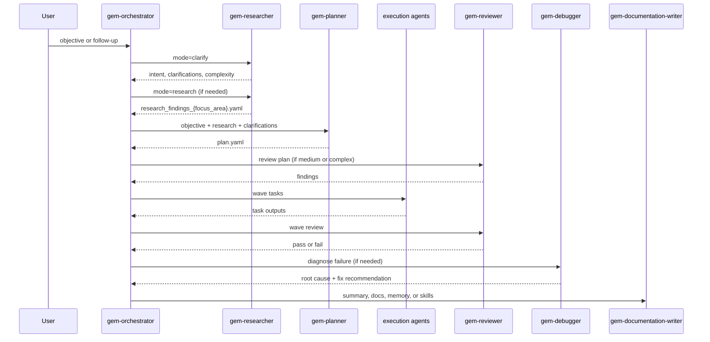

Gem Team is organized as a plugin repository, not a runtime library. The top-level manifests such as `plugin.json`, `.claude-plugin/plugin.json`, `.cursor-plugin/plugin.json`, `.github/plugin/plugin.json`, and `apm.yml` all register the same implementation root: `.apm/agents`. That directory is the real product. Each `.agent.md` file defines one role, its workflow, and its I/O contract.

```mermaid
graph TD
  U[User Request] --> O[gem-orchestrator.agent.md]
  O --> R[gem-researcher.agent.md]
  O --> P[gem-planner.agent.md]
  P --> PLAN[docs/plan/{plan_id}/plan.yaml]
  R --> RF[research_findings_{focus_area}.yaml]
  O --> E1[gem-implementer]
  O --> E2[gem-implementer-mobile]
  O --> E3[gem-browser-tester]
  O --> E4[gem-mobile-tester]
  O --> E5[gem-devops]
  O --> E6[gem-designer]
  O --> E7[gem-designer-mobile]
  O --> Q1[gem-reviewer]
  O --> Q2[gem-critic]
  O --> Q3[gem-debugger]
  O --> D[gem-documentation-writer]
  E1 --> Q1
  E2 --> Q1
  E3 --> Q1
  E4 --> Q1
  Q1 --> O
  Q2 --> O
  Q3 --> O
  D --> MEM[docs/skills + memory + PRD/AGENTS updates]
```

## Module Boundaries

The strongest boundary in the repo is between coordination and execution. `gem-orchestrator.agent.md` explicitly says the orchestrator must never read, write, edit, run, or analyze directly; it only decides delegation. That design makes the orchestrator a pure control plane. Research, planning, implementation, review, debugging, testing, and documentation are all isolated in separate files with separate contracts.

The second boundary is between planning artifacts and task execution. `gem-planner.agent.md` defines `plan.yaml` as a DAG with `tasks`, `contracts`, `dependencies`, `conflicts_with`, `estimated_lines`, and agent-specific task fields. Execution agents consume `task_definition` objects derived from that plan instead of inventing their own local format. This reduces ambiguity at handoff time and lets `gem-reviewer` audit the plan independently before work starts.

The third boundary is between work products and knowledge products. `gem-documentation-writer.agent.md` owns documentation parity, PRD creation, AGENTS.md maintenance, memory updates, and skill extraction. That keeps long-lived artifacts out of execution agents and makes learning persistence a first-class capability rather than an afterthought.

## Key Design Decisions

### Markdown agent specs instead of code modules

Each agent is stored as a Markdown file with YAML frontmatter plus structured sections like `## Workflow`, `## Input Format`, `## Output Format`, and `## Rules`. That choice makes the system portable across host tools. The manifests only need to point at a directory of specs; there is no runtime-specific adapter layer inside this repository.

### A single user-facing orchestrator

Only `gem-orchestrator.agent.md` is marked `user-invocable: true`; every other agent is internal. The result is a narrow public surface: users describe an objective once, and the orchestrator decides when to invoke clarify mode, when to trigger plan review, and when to loop through retries. That keeps the external UX simple while preserving internal specialization.

### Plan-first execution with bounded task sizing

`gem-planner.agent.md` enforces `estimated_files <= 3` and `estimated_lines <= 300` alongside wave assignment and failure-mode capture. The intent is clear in source: keep tasks small enough to finish in one session and explicit enough to validate. This is why Gem Team can run multiple wave tasks in parallel without losing control of contracts or context.

### Verification is not optional

The orchestrator always routes failures through `gem-debugger` before retrying. `gem-reviewer.agent.md` owns plan review, wave integration checks, task review, and final review. `gem-critic.agent.md` exists specifically to challenge assumptions and over-engineering. The source files make verification structural, not a “best effort” recommendation.

### Learning is centralized

`gem-documentation-writer.agent.md` handles memory updates, skill creation, AGENTS.md maintenance, and PRD updates. That is a deliberate separation of concerns: execution agents emit learnings, but only the documentation writer persists them. This prevents every agent from mutating long-lived governance files independently.

## Request and Data Lifecycle



## How The Pieces Fit Together

Gem Team is best understood as an artifact pipeline. The orchestrator turns a natural-language request into a `plan_id`. The researcher turns ambiguity into clarifications or factual findings. The planner turns those findings into a machine-checkable DAG. Execution agents then operate on one bounded task at a time. Review and debug agents act as gates around those tasks, and the documentation writer turns the final state into persistent project knowledge.

That architecture also explains why there are multiple agent variants for similar domains. `gem-implementer` and `gem-implementer-mobile` share a TDD posture, but mobile-specific testing, platform validation, and recovery steps are materially different, so Gem Team gives them different specs. The same pattern appears with `gem-designer` versus `gem-designer-mobile`, and with `gem-browser-tester` versus `gem-mobile-tester`.

If you are integrating Gem Team into a plugin host, the critical rule is simple: expose the orchestrator, register the agent directory, and let the file-defined workflows govern behavior. The docs in the rest of this site explain those contracts in detail.
