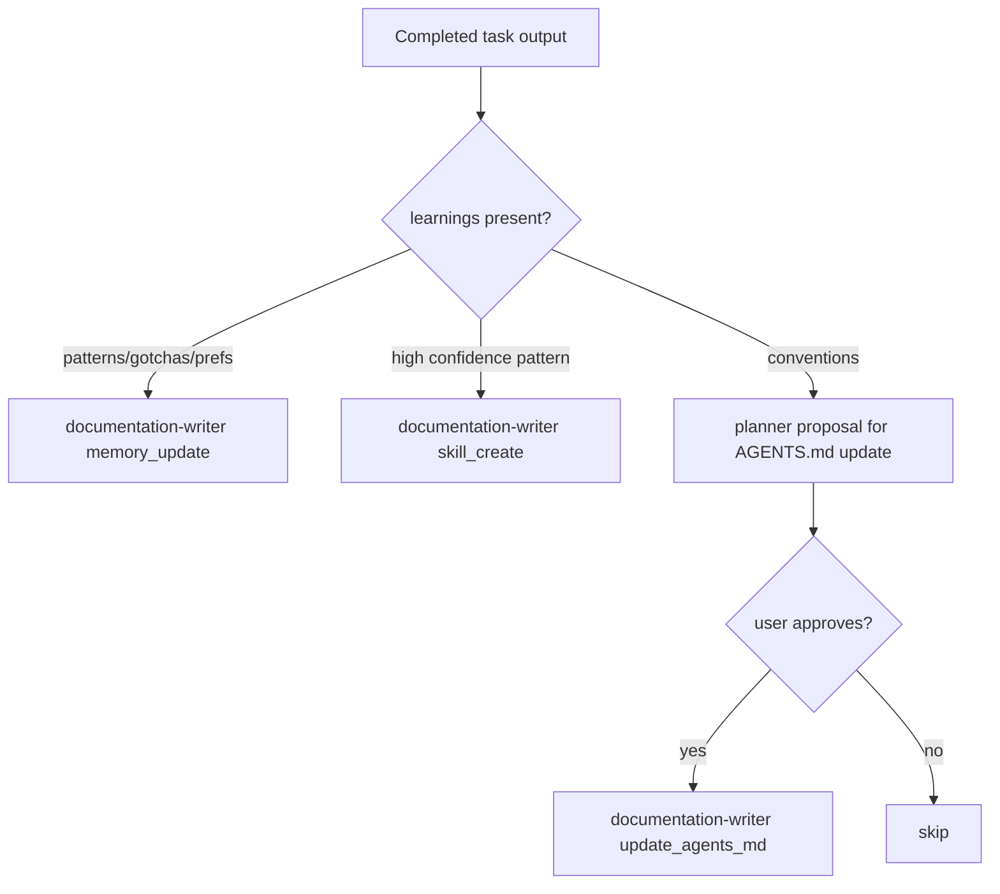

Gem Team’s learning system is spread across the README and `gem-documentation-writer.agent.md`, but the core idea is simple: completed work should leave behind reusable knowledge. The README calls this a triple learning system with memory, skills, and conventions. The documentation writer owns the persistence rules for all three.

## What It Is

The learning system is the mechanism that turns one successful task into future leverage. Instead of keeping useful patterns inside one agent’s response, Gem Team can:

- save memory entries globally or locally,
- create skills from high-confidence patterns,
- propose conventions for AGENTS.md with explicit user approval.

This exists because repeated work is expensive, and repeated mistakes are worse.

## How It Relates To Other Concepts

The [Orchestration Lifecycle](/docs/orchestration-lifecycle) only feels complete because it ends with summary and learning persistence. [Wave Execution](/docs/wave-execution) produces the task outputs that may contain patterns and gotchas. [Research And Planning](/docs/research-and-planning) improves over time when prior patterns and user preferences are available as memory or skills.

## How It Works Internally

In `gem-orchestrator.agent.md`, Phase 7 explicitly collects learnings from completed task outputs. If patterns, gotchas, or user preferences exist, the orchestrator delegates a memory update to `gem-documentation-writer`. The same phase also reviews `learnings.patterns[]` for skill extraction:

- `confidence >= 0.85`: auto-create a skill
- `0.6 <= confidence < 0.85`: ask the user first
- below `0.6`: skip

`gem-documentation-writer.agent.md` then defines where those artifacts go:

- global patterns, gotchas, fixes, and user preferences in memory locations,
- local plan-level memory under the plan directory,
- `docs/skills/{skill-name}/SKILL.md` for extracted skills,
- AGENTS.md updates only after explicit approval.



### Basic memory example

```json
{
  "task_type": "memory_update",
  "task_definition": {
    "scope": "local",
    "inputs": {
      "learnings": {
        "gotchas": [
          "Run targeted tests before full-suite review for auth changes."
        ],
        "patterns": [
          "Preserve existing response envelopes during logging refactors."
        ]
      }
    }
  }
}
```

### Skill extraction example

```json
{
  "task_type": "skill_create",
  "task_definition": {
    "patterns": [
      {
        "name": "contract-first-auth-hardening",
        "when_to_apply": "Security-sensitive auth changes with multiple dependent tasks",
        "code_example": "Define reviewer-facing contracts in plan.yaml before implementation",
        "anti_pattern": "Let tests and reviews guess the intended response format",
        "context": "Express authentication changes",
        "confidence": 0.92
      }
    ],
    "source_task_id": "task-4"
  }
}
```

<Callout type="warn">AGENTS.md is intentionally not auto-updated. The orchestrator file says convention proposals must be presented to the user first, and the documentation writer only performs the update after approval. Treating AGENTS.md like disposable memory would blur the line between dynamic learnings and durable governance.</Callout>

## Trade-offs

<Accordions>
<Accordion title="Global memory vs local plan memory">
Global memory is useful for preferences and patterns that should affect future projects, while local memory is safer for plan-specific gotchas and context. Gem Team supports both because a single storage scope would either overfit to one task or under-share repeated lessons. The trade-off is that hosts need a clear storage convention to avoid duplicates and drift. The documentation writer mitigates that by categorizing and deduplicating entries before saving them.
</Accordion>
<Accordion title="Automatic skills vs manual curation">
Auto-creating skills from high-confidence patterns makes the system genuinely self-improving instead of merely aspirational. The risk is that noisy or overly narrow patterns could fossilize into reusable instructions too early. Gem Team manages that by requiring a high confidence threshold for automatic extraction and a confirmation step for medium-confidence patterns. This is a pragmatic compromise between zero learning and uncontrolled prompt sprawl.
</Accordion>
</Accordions>

If you want Gem Team to improve over time rather than repeat itself, the learning system is the concept to preserve intact.
