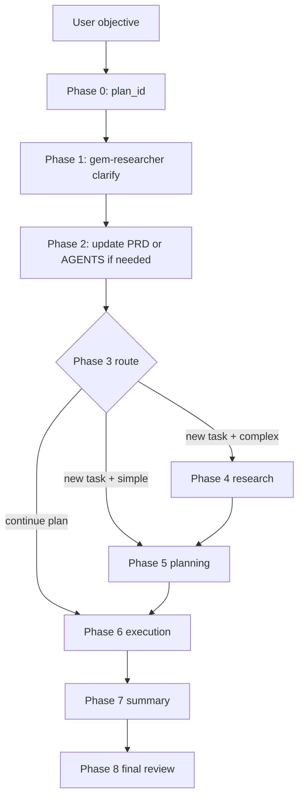

The orchestration lifecycle is the backbone of Gem Team. In `.apm/agents/gem-orchestrator.agent.md`, the workflow literally says: "On ANY task received, ALWAYS execute steps 0→1→2→3→4→5→6→7→8 in order." That line matters because it defines Gem Team as a process engine, not just a bag of specialized prompts.

## What It Is

The lifecycle is the fixed phase model that every request passes through:

1. Generate or reuse a `plan_id`.
2. Clarify the request with `gem-researcher`.
3. Persist any clarified governance information through `gem-documentation-writer`.
4. Route into research, planning, or direct execution based on intent and complexity.
5. Execute plan waves.
6. Summarize and optionally run a final review.

This exists to solve a common failure mode in LLM-assisted engineering: jumping from user request to implementation without stable requirements, bounded tasks, or verification gates.

## How It Relates To Other Concepts

The lifecycle depends on [Research And Planning](/docs/research-and-planning) for artifact generation, [Wave Execution](/docs/wave-execution) for task scheduling, and [Learning System](/docs/learning-system) for persistence after completion. If you remove the lifecycle, the other concepts still describe useful pieces, but there is no source-backed rule that ties them together consistently.

## How It Works Internally

`gem-orchestrator.agent.md` is user-invocable and sets `disable-model-invocation: true`. That means the orchestrator is intentionally a non-executing coordinator. The file then defines:

- Phase detection via `gem-researcher` in `mode=clarify`.
- Optional documentation updates if clarifications or architectural decisions were found.
- Routing logic for `continue_plan`, `new_task`, and `modify_plan`.
- Parallel research up to four focus areas.
- Planning review with `gem-reviewer` and `gem-critic` depending on complexity.
- Wave execution with retry rules, debugger handoff, and integration review.
- Summary, learning persistence, skill extraction, and a user-triggered final review.



### Basic usage

```text
Use gem-orchestrator.
Objective: add audit logging to the admin API.
Constraints: preserve response shapes, write tests first, include docs updates.
```

In source terms, that prompt enters Phase 1 immediately. The orchestrator does not skip to implementation, even if the request sounds direct.

### Resume an existing plan

```text
Use gem-orchestrator.
plan_id: 20260507-admin-audit-logging
Continue execution and rerun final review after fixes.
```

Because Phase 3 explicitly handles `continue_plan`, the orchestrator can move straight into planning updates or execution based on the current plan state.

<Callout type="warn">Do not treat the orchestrator like a direct implementation agent. The source file explicitly forbids it from reading, writing, editing, running, or analyzing directly. If your host bypasses delegation and lets the orchestrator execute tasks itself, you are no longer running Gem Team as designed.</Callout>

## Trade-offs

<Accordions>
<Accordion title="Strict phase ordering vs raw speed">
The fixed phase order is slower on trivial tasks than a single direct answer, and the source acknowledges that by allowing plan validation to be skipped for low-complexity cases. Even so, the orchestrator still runs clarify mode first because the project treats ambiguity as a more expensive failure than a few extra tool calls. In practice, this means Gem Team optimizes for correctness under change, not for the shortest possible first response. If you want a one-shot assistant, this architecture is intentionally more opinionated than that.
</Accordion>
<Accordion title="One public entry point vs direct specialist access">
Gem Team keeps the public surface narrow by making the orchestrator the only user-invocable agent. That is easier for end users because they do not need to decide whether a task starts with research, planning, debugging, or review. The cost is that power users must work through one more coordination layer even when they already know the right specialist. The source compensates by making the orchestrator brutally explicit about routing rules, retry budgets, and escalation paths.
</Accordion>
</Accordions>

The lifecycle is the first concept to internalize because every other page in these docs assumes you are operating within this phase model.
