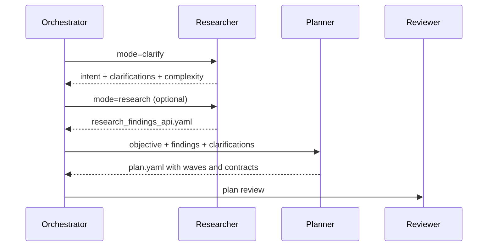

Research and planning are the artifact-producing half of Gem Team. `gem-researcher.agent.md` produces structured findings, while `gem-planner.agent.md` converts those findings into a `plan.yaml` DAG with tasks, dependencies, contracts, and risk metadata. This pairing exists so execution agents do not have to improvise architecture mid-flight.

## What It Is

Research in Gem Team is not brainstorming. The researcher file explicitly says "NO suggestions/recommendations" in the synthesized YAML report. The planner then consumes those facts, plus PRD scope and task clarifications, to create a task graph that is small enough to execute and concrete enough to review.

## How It Relates To Other Concepts

This concept feeds [Wave Execution](/docs/wave-execution) directly because waves come from planner output. It also feeds [Orchestration Lifecycle](/docs/orchestration-lifecycle) because the orchestrator routes tasks into clarify mode, research mode, or planning based on complexity and ambiguity. Learning persistence later depends on the quality of research artifacts because skills and conventions are only as good as the facts that informed them.

## How It Works Internally

The researcher has two modes:

- `clarify`: infer user intent, identify gray areas, and emit `task_clarifications` or `architectural_decisions`.
- `research`: analyze the codebase, extract patterns, map dependencies, and write `research_findings_{focus_area}.yaml`.

The source also defines an early-exit optimization: if confidence is at least `0.9` and scope is small, the researcher can skip deeper passes. That makes the workflow adaptive without abandoning its evidence-first posture.

The planner then applies those findings to a fixed plan schema. The `plan_format_guide` in `.apm/agents/gem-planner.agent.md` defines fields for:

- `plan_metrics`
- `open_questions`
- `gaps`
- `pre_mortem`
- `implementation_specification`
- `contracts`
- `tasks`

Each task carries sizing, coverage, verification, agent routing, and failure-mode information.



### Basic research example

```json
{
  "plan_id": "20260507-auth-hardening",
  "objective": "Harden authentication flows without changing login UX",
  "focus_area": "auth-stack",
  "mode": "research",
  "task_clarifications": [
    {
      "question": "Should session storage stay cookie-based?",
      "answer": "Yes, preserve cookie sessions."
    }
  ]
}
```

### Planning example

```yaml
plan_id: 20260507-auth-hardening
objective: Harden authentication flows without changing login UX
research_confidence: high
contracts:
  - from_task: task-1
    to_task: task-3
    interface: auth_error_response
    format: json
tasks:
  - id: task-1
    title: Add auth security regression tests
    wave: 1
    agent: gem-implementer
    estimated_lines: 120
    verification:
      - targeted unit tests
  - id: task-3
    title: Review auth changes for PRD and security compliance
    wave: 2
    agent: gem-reviewer
    dependencies: [task-1]
```

<Callout type="warn">Do not skip clarifications just because the objective sounds specific. In Gem Team source, clarify mode is phase one of every task. If unresolved decisions leak into planning, the DAG will look precise while still encoding the wrong assumptions.</Callout>

## Trade-offs

<Accordions>
<Accordion title="Confidence-based early exit vs exhaustive discovery">
The researcher computes confidence from coverage, patterns found, architecture evidence, dependency evidence, and open questions. That means Gem Team can stop early on small, well-understood areas and avoid wasting tokens. The trade-off is that confidence is heuristic, so a narrow codebase slice can still hide cross-cutting dependencies. For high-impact work, the planner and reviewer phases are the backstop that catch under-researched assumptions.
</Accordion>
<Accordion title="Bounded tasks vs large implementation batches">
The planner forces task sizing down to at most three files and roughly three hundred lines. That makes retries cheaper, wave scheduling easier, and reviews more targeted. The cost is more overhead when a change is naturally broad, because the planner must split work into slices and define contracts between them. Gem Team accepts that cost because recovery and verification are better when each slice has a clear responsibility.
</Accordion>
</Accordions>

Research and planning are where Gem Team earns most of its rigor. If you understand these artifacts, the rest of the system becomes much easier to reason about.
