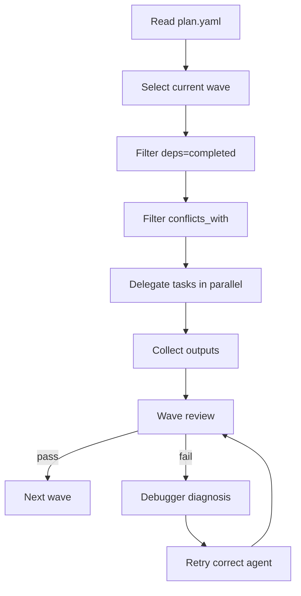

Wave execution is how Gem Team turns a plan from a static document into a controlled run. The planner assigns each task a `wave`, `dependencies`, `conflicts_with`, and `agent`. The orchestrator then walks those waves in order, running independent work in parallel while preserving explicit handoff contracts.

## What It Is

A wave is a set of tasks that can run concurrently because their dependencies are already satisfied and they do not conflict on the same files or resources. This exists so Gem Team can claim parallel speedups without giving up determinism or reviewability.

## How It Relates To Other Concepts

Wave execution depends on [Research And Planning](/docs/research-and-planning) because waves are created in `plan.yaml`. It sits inside [Orchestration Lifecycle](/docs/orchestration-lifecycle) as Phase 6. It also feeds [Learning System](/docs/learning-system) because completed wave outputs can emit patterns, gotchas, and user preferences that the documentation writer persists.

## How It Works Internally

The core execution rules are in `gem-orchestrator.agent.md`:

- Sort waves ascending.
- For each wave, select pending tasks whose dependencies are completed.
- Serialize conflicting tasks.
- Delegate each task to the assigned agent, up to four concurrent tasks.
- After each wave, run `gem-reviewer(review_scope=wave, wave_tasks={completed})`.
- If review fails, call `gem-debugger`, inject the diagnosis, retry the appropriate execution agent, and re-run integration.

This makes execution a closed loop rather than a fire-and-forget dispatch.



### Basic multi-wave example

```yaml
tasks:
  - id: task-1
    title: Add API tests
    wave: 1
    agent: gem-implementer
    dependencies: []
    conflicts_with: []
  - id: task-2
    title: Add logging implementation
    wave: 1
    agent: gem-implementer
    dependencies: []
    conflicts_with: []
  - id: task-3
    title: Run security review
    wave: 2
    agent: gem-reviewer
    dependencies: [task-1, task-2]
```

### Failure recovery example

```json
{
  "task_id": "task-2",
  "plan_id": "20260507-request-logging",
  "error_context": {
    "error_message": "Regression: API returns 500 on invalid payload",
    "failing_test": "logs invalid payload without crashing",
    "environment": "ci"
  }
}
```

That payload is handed to `gem-debugger`, which returns a root cause and fix recommendation before the orchestrator chooses the retry path.

<Callout type="warn">Do not confuse `dependencies` with `conflicts_with`. Dependencies describe order because of required outputs. Conflicts describe serialization because two tasks would otherwise touch the same files or unstable resources at the same time. Collapsing them into one concept reduces safe parallelism and makes plans harder to review.</Callout>

## Trade-offs

<Accordions>
<Accordion title="Parallelism vs isolation">
Gem Team allows up to four parallel delegations, which is enough to realize most of the README's performance story without turning execution into uncontrolled fan-out. The orchestrator still serializes same-file conflicts and intra-wave dependencies because concurrency is only valuable when the outputs remain mergeable and reviewable. This design favors bounded concurrency over maximum concurrency. In practice, that is the right trade for code changes where hidden coupling is more expensive than a slightly longer wall clock.
</Accordion>
<Accordion title="Contracts vs loose handoffs">
The planner requires `contracts` between dependent tasks so a downstream task knows what interface or artifact it expects. This adds planning overhead because someone has to name the boundary explicitly, even for seemingly obvious flows. The payoff is that wave reviews and final reviews can verify whether the planned contract was actually satisfied. Without contracts, task handoffs become folklore and failures become much harder to diagnose.
</Accordion>
</Accordions>

Wave execution is the point where Gem Team starts to look more like a disciplined build pipeline than a chat workflow. That is by design.
